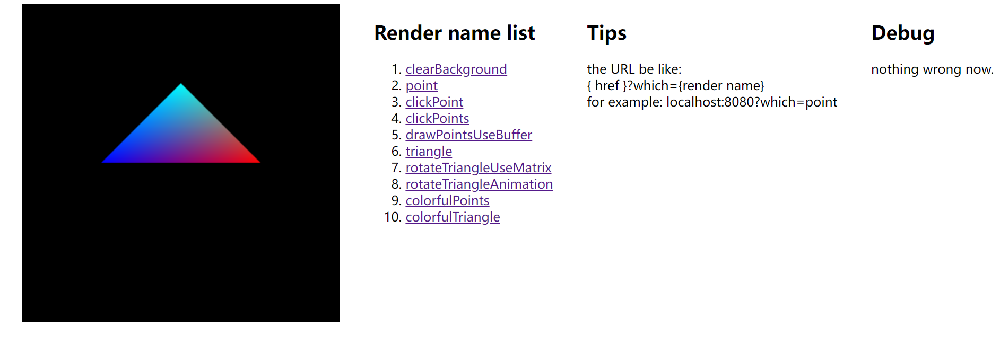

# web-gl-example

原生`web-gl`样例展示。

## 线上地址

[点击这里查看](https://creampnx-x.github.io/web-gl-example/dist/)

## TODO

1. 继续编写剩余renderer例子
2. 重构`Example`, 去掉类变为函数式 (推迟)
3. 动画 (基础的已经做了 2022/8/9)
4. varying 变量 (2022/8/10)
5. texture 纹理

## 执行方法

```sh
yarn
yarn start # 启动 8080 端口
yarn build # 编译
```

## 效果

彩色三角形的渲染结果：


